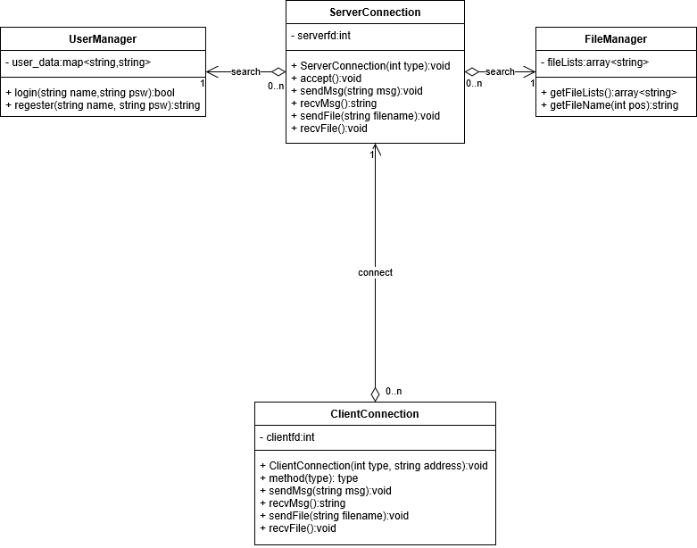
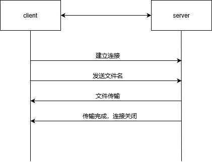
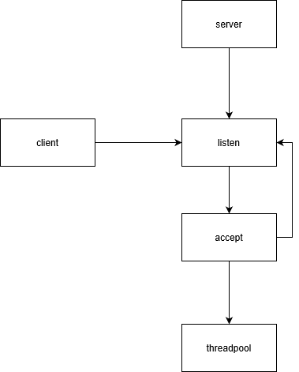
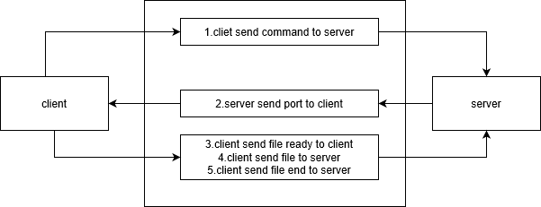

# FTPServer

这是一个文件服务器。使用C++ ThreadPool实现。

## 目录

整体目录结构：

├─client 客户端根目录
│  └─src 客户端代码
├─images
├─lib 公用库
├─server 服务端根目录
│  └─src 服务端代码
└─test 一些测试用代码
详细目录结构：[详细目录](dir.txt)

### client

客户端根目录

编译：

```shell
sh make
```

运行：

```shell
cd debug
./client host
```

### server

服务端根目录

编译：

```shell
sh make
```

运行：

```shell
cd debug
./server
```

**注：**需自行设置用户文件

## 需求

### 服务端

- 支持客户端请求查询文件（文件名称，文件大小，更改日期），上传文件，下载文件，删除文件
- 支持多客户端并发向服务请求操作
- 信令走TCP，数据传输支持TCP/UDP两种方式可选。

### 客户端

- 查询文件列表
- 文件上传
- 文件下载
- 文件删除

### 待选需求

- 局域网内服务器发现（组播方式）
- 上传，下载支持断点上传和下载
- 支持用户安全机制：用户登录鉴权，权限控制。
- 数据传输走安全传输 SSL

## 名词表

| 名字          | 值    | 描述                |
| ------------- | ----- | ------------------- |
| CLIENT_CMD    | int   | 客户端命令，int类型 |
| CLIENT_EOF    | 0     | 客户端结束操作      |
| DOWNLOAD_FILE | 1     | 下载命令            |
| UPLOAD_FILE   | 2     | 上传命令            |
| DELETE_FILE   | 3     | 删除文件            |
| MAX_UDP       | 16    | 最大UDP监听数       |
| MAX_NUM       | 32    | 初始化线程池线程数  |
| BUFF_SIZE     | 4086  | 缓冲区大小          |
| QUEQUE_SIZE   | 10    | 监听队列大小        |
| TCP_PORT      | 12345 | TCP连接端口         |
| conn_type     | int   | 连接类型，int类型   |
| TCP_TYPE      | 0     | TCP连接类型         |
| UDP_TYPE      | 1     | UDP连接类型         |
| Task          | void* | 任务，函数指针      |

## 对象模型



### Connection

#### 变量

- fd：连接套接字描述符
- addr：本机地址信息

#### 函数

##### void sendFileUDP(string filename, sockaddr *ra)

- filename：待发送文件名
- ra：接受方地址

该函数主要实现使用UDP连接发送信息的功能。错误信息需使用writeLog写入日志中。

##### void recvFileUDP(string filename)

- filename：待发送文件名

该函数主要实现使用UDP接受信息的功能。错误信息需使用writeLog写入日志中。

##### void sendMsg(int connfd, string msg, sockaddr *ra=NULL)

- connfd：发送信息的套接字描述符
- msg：待发送的信息
- ra：接受方地址，可为空

该函数主要实现发送信息的功能。错误信息需使用writeLog写入日志中。

##### string recvMsg(int connfd, sockaddr *sa=NULL)

- connfd：接受信息的套接字
- sa：用来存放发送方地址，可为空

该函数主要实现接收信息的功能。错误信息需使用writeLog写入日志中。

##### void close_self()

对close函数的封装。

#### ServerConnection

Connection的子类。

##### 变量

- port：端口

##### 函数

int accptTCP()：对accpt函数的封装。

#### ClientConnection

Connection的子类。

### FileManager

#### 变量

- files_lists：存放文件名的列表

#### 函数

##### array\<string> getFilesList()

该函数返回文件名列表。

##### string getFileName(int pos)

返回指定位置的文件名。

### Log

#### 变量

- filename：log文件名

#### 函数

##### void writeLog(string msg)

- msg：写入的信息

该函数用于向日志文件中写入信息。

### ThreadPool

#### 变量

- _thread_pool：线程池
- _tasks：任务队列
- _lock：互斥锁
- _task_cv：信号量
- _run：线程池运行状态
- _free_thread_num:空闲线程数

#### 函数

##### void commit(F&&f, Args&& ...args)

- f：函数
- args：可变参数列表

该函数用于插入任务。

##### void addThread(int num)

- num：新健线程数

该函数用于新建线程

### UserManager

#### 变量

- _user_data：一个存放用户信息的哈希表

#### 函数

##### bool login(string name, string psw)

- name：用户名称
- psw：用户密码

该函数用户查看是否有该用户，返回查询结果。

## 迭代1

### 模型



### 需求

- 服务器和客户端的连接
- 指定文件的传输

## 迭代2

### 模型


### 需求

- 利用TCP传输信令
- 传输文件列表
- 选择文件UDP传输

## 迭代3

### 模型



### 需求

- 利用select实现并发文件下载
- 使用threadpool实现并发

## 迭代四

### 模型

系统模型和迭代三相同，这里主要讨论几个模块的数据流图。

#### 用户登录


#### 文件下载


#### 文件上传



### 需求

- 实现用户验证
- 实现文件上传

## 参考文档

- [C++11线程池实现](https://www.cnblogs.com/lzpong/p/6397997.html)
- [根据linux内核源码查找recv返回EBADF(errno 9)的原因](https://www.cnblogs.com/james1207/p/3400192.html)

